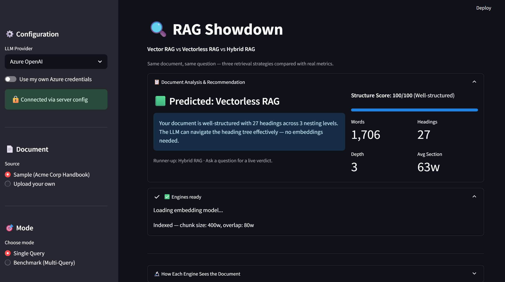

# 🔍 RAG Showdown: Vector vs Vectorless vs Hybrid

A hands-on, side-by-side comparison of **3 RAG (Retrieval-Augmented Generation) strategies** — same document, same question, real metrics. Built with Streamlit.


> **Note:** This is a **learning & comparison tool**, not a production-ready RAG system. See [Disclaimer](#-disclaimer--limitations) below.

---

## Screenshots

### Homepage — Document Analysis & Recommendation


### Live Winner — Per-Query Scoring


### Side-by-Side Query Results


### Document Visualization — Vector RAG Chunks


### Document Visualization — Vectorless RAG Heading Tree


### Benchmark Mode — Multi-Query Comparison & Cost Projection


---

## What This Demo Shows

| Approach | How It Retrieves | Key Idea |
|----------|-----------------|----------|
| **🟦 Vector RAG** | Chunk → Embed → Cosine similarity search | *"Find text that looks similar"* |
| **🟩 Vectorless RAG** | Parse headings → Build tree → LLM reasons through tree | *"Think about where the answer lives"* |
| **🟨 Hybrid RAG** | Vector search + Tree reasoning + LLM reranker | *"Cast a wide net, then reason about what's relevant"* |

All three use the **same document** and **same question**, so you can directly compare answers, latency, token usage, and cost.

---

## Features

- **Side-by-side comparison** — Three engines answer the same question simultaneously
- **Document Analysis** — Structure score, heading count, depth, and live recommendation of which RAG approach suits your document best
- **Upload your own docs** — Supports **PDF**, **DOCX**, **TXT**, and **Markdown**
- **Benchmark mode** — Run 8 auto-generated questions across all engines with summary stats
- **Document visualization** — See how Vector RAG chunks your doc vs how Vectorless RAG builds a heading tree (Graphviz)
- **Cost-at-scale calculator** — Estimate costs for 100 / 1K / 10K queries
- **Configurable chunking** — Adjust chunk size and overlap, apply and re-index instantly
- **BYOK (Bring Your Own Key)** — Server config works out of the box, or toggle to use your own Azure OpenAI / OpenAI credentials
- **Export results** — Download comparisons as **CSV**, **JSON**, **PDF report**, or **TXT**
- **Live winner tracking** — Weighted scoring (40% cost, 30% latency, 30% tokens) updated per query
- **About & Disclaimer** — In-app transparency about limitations and production gaps

---

## Quick Start

### 1. Clone & Install

```bash
git clone https://github.com/ManikantaBathinedi/RAGShowdown.git
cd RAGShowdown

python -m venv .venv
# Windows
.venv\Scripts\activate
# macOS/Linux
source .venv/bin/activate

pip install -r requirements.txt
```

### 2. Configure API Keys

**Option A — Use the built-in server config** (keys already included for demo use):
Just run the app. It will connect automatically.

**Option B — Use your own keys:**
```bash
cp .env.example .env
# Edit .env with your own credentials
```

Or toggle **"Use my own Azure credentials"** in the sidebar at runtime.

### 3. Run

```bash
streamlit run app.py
```

Opens at `http://localhost:8501`.

---

## How Each Engine Works

### 🟦 Vector RAG (`vector_rag.py`)

The traditional approach used by most RAG systems today.

```
Document → Fixed-size chunks (configurable: 400w default, 80w overlap)
         → Embed each chunk (all-MiniLM-L6-v2, 384 dimensions)
         → Store in ChromaDB (in-memory)
         → Query: embed question → cosine similarity → top-3 chunks → LLM generates answer
```

**Pros:** Fast, works with any text, battle-tested
**Cons:** "Similar" ≠ "relevant", chunking can break context

### 🟩 Vectorless RAG (`vectorless_rag.py`)

Inspired by [PageIndex](https://github.com/VectifyAI/PageIndex) — no embeddings, no vector DB.

```
Document → Parse headings into hierarchical tree (markdown or plain-text heuristics)
         → Build table of contents summary
         → Query: LLM reads TOC → reasons about which sections to read
         → Retrieve full sections → LLM generates answer
```

**Pros:** Precise for structured docs, explainable retrieval, no embedding infrastructure
**Cons:** Needs document structure (headings), 2 LLM calls per query, weaker on flat text

### 🟨 Hybrid RAG (`hybrid_rag.py`)

Best of both worlds — broad recall + precise reasoning.

```
Query → Vector search (broad candidates, top-5)
      → Tree reasoning (precision picks, top-3)
      → Merge & deduplicate all candidates
      → LLM reranks by relevance → top-3 final context
      → LLM generates answer
```

**Pros:** Highest accuracy, robust across document types
**Cons:** Most expensive (3+ LLM calls), highest latency

---

## Project Structure

```
rag-showdown/
├── app.py                  # Streamlit UI — main entry point (~1100 lines)
├── vector_rag.py           # Vector-based RAG engine
├── vectorless_rag.py       # Vectorless (tree reasoning) RAG engine
├── hybrid_rag.py           # Hybrid RAG engine (shares Vector + Vectorless instances)
├── doc_analyzer.py         # Document structure analyzer & recommendation engine
├── benchmark.py            # Multi-query benchmark runner & cost estimator
├── sample_document.md      # Sample document (Acme Corp Employee Handbook 2026)
├── models/                 # Pre-downloaded embedding model (all-MiniLM-L6-v2)
├── requirements.txt        # Python dependencies
├── .env.example            # API key template
├── .gitignore              # Excludes .env, models/, __pycache__, .venv
└── README.md               # This file
```

---

## Sample Questions to Try

These highlight the differences between the approaches:

| Question | Why It's Interesting |
|----------|---------------------|
| *"How many PTO days does a 4-year employee get?"* | Requires finding a specific detail in a specific section |
| *"What is the expense approval chain for a $3000 expense?"* | Needs precise threshold matching across data |
| *"What are the promotion criteria?"* | Clear section heading — Vectorless should nail this |
| *"What technology stack does the company use?"* | Multiple related chunks vs one clean section |
| *"How does 401k matching work and when does it vest?"* | Requires combining info within a section |
| *"What is the on-call compensation?"* | Tests retrieval of specific policy details |
| *"When was the company founded and by whom?"* | Simple factual retrieval from intro section |
| *"What is the parental leave policy?"* | Tests section navigation vs keyword matching |

---

## Supported LLM Providers

| Provider | Setup | Notes |
|----------|-------|-------|
| **Azure OpenAI** | Endpoint + API key + deployment name | Default. Server config included for demo |
| **OpenAI** | API key | GPT-4o-mini, GPT-4o, GPT-3.5-turbo |
| **Ollama (Local)** | Local URL | Free, requires local Ollama installation |

---

## Tech Stack

- **Frontend:** Streamlit 1.44.1
- **LLM:** Azure OpenAI (gpt-4o-mini) / OpenAI / Ollama
- **Vector DB:** ChromaDB (in-memory)
- **Embeddings:** sentence-transformers (all-MiniLM-L6-v2)
- **PDF Parsing:** PyPDF2
- **DOCX Parsing:** python-docx
- **PDF Reports:** fpdf2
- **Visualization:** Graphviz (via st.graphviz_chart), Pandas, NumPy

---

## ⚠️ Disclaimer & Limitations

This is a **learning and comparison tool**, not a production RAG system.

| Area | This Demo | Production Systems |
|------|-----------|-------------------|
| Document Parsing | PyPDF2 / python-docx (basic) | Azure Document Intelligence, LlamaParse, Unstructured.io |
| Vector Store | ChromaDB in-memory (lost on restart) | Pinecone, Weaviate, Azure AI Search, pgvector |
| Chunking | Simple word-count splitting | Semantic chunking, recursive splitting |
| Embeddings | all-MiniLM-L6-v2 (384d) | text-embedding-3-large, Cohere embed-v3, fine-tuned models |
| Vectorless Parsing | Heuristic heading detection | LLM-generated summaries (RAPTOR), structured parsing APIs |
| Reranking | None | Cohere Rerank, cross-encoders |
| Evaluation | Manual comparison | RAGAS, DeepEval, LLM-as-judge |
| Scale | Single document | Thousands of docs, metadata filtering, multi-tenant |
| Guardrails | None | Hallucination detection, citation verification |

**Accuracy expectations:**
- Vector RAG: ~70–80% (production: 85–95% with reranking)
- Vectorless RAG: ~60–85% (depends on document structure)
- Hybrid: Generally best, but our merge is basic

*The architecture and concepts are sound — the gaps are in component quality, not design.*

---

## License

MIT — use it, fork it, learn from it.

---

<p align="center">Crafted with ❤️ by <b>Manime</b></p>
